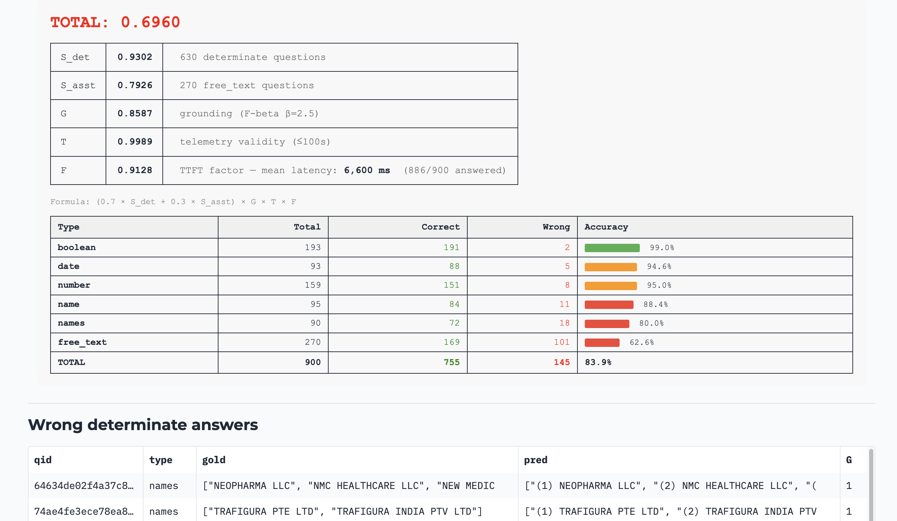

# Юридическое поле экспериментов для RAG

*Agentic RAG Legal Challenge, март 2026*

**[Иван Комаров](https://habr.com/ru/users/ivankomarov/), [Евгений Чуканов](https://habr.com/ru/users/set610/)**

MORAG: [github.com/catonmoon/morag](https://github.com/catonmoon/morag) · Eval: [manzherok.ru/eval](https://manzherok.ru/eval/)

---

Можно ли делать RAG на MacStudio M3 Ultra? CAG - убийца RAG? Самый лучший RAG от OpenAI и Grok? 

Ответы на эти вопросы мы узнали во время участия в соревновании [Agentic RAG Legal Challenge](https://agentic-challenge.ai). Стоит отметить хорошую организацию соревнования и продуманные метрики. Более 300 команд со всего мира.

А ответы на вопросы - под катом

## We love RAG!

Нам нравится тема RAG (retrieval augmented generation). Почему? Потому что без RAG никуда. А как показало соревнование, о котором я расскажу ниже, заменить его вообще нечем.

RAG — это когда есть свои документы и надо чтобы система их выучила. Самое простое (и оказывается лучшее) — просто найти нужные части или документы и подать их в промпт вместе с вопросом для формулировки ответа ЛЛМ. Т.е. когда вам нужен ответ "Как включить стиралку?", система просто открывает инструкцию на нужном месте и переформулирует технический на "нажми эту кнопку".

Когда вы начинаете делать такую систему для вашей компании, вы также осознаёте важность **ссылок** на место, откуда система взяла кусок текста — а что если машина открыла инструкцию не на "включить", а "прочистить стиралку"? Хорошо бы глянуть прямо на сырой документ. Ведь вы спрашиваете систему, потому что вы **не знаете** ответ, соответственно вы по умолчанию **верите** системе. Если она ошибается — значит надо проверять. К этому, кстати, нас приучили поисковики — они по умолчанию просто дают ссылки, а не ответ.

Что же у нас появилось нового по сравнению с веком Интернета? В интернете при поиске важна скорость, поэтому документы должны быть проиндексированы, а ссылки выдаваться по индексу быстро. Именно оттуда пришла современная реализация BM25 — по сути поиск по ключевым словам, усиленный TF-IDF и другими трюками. BM25 ищет слова. Но главная новинка RAG-эпохи — это **семантический поиск** (embeddings): когда система ищет не слова, а смысл. Именно их сочетание и даёт современный RAG.

Ещё один важный аспект — скорость. Хотя, как мы видим с рассуждающими моделями, человек может и подождать, если нужен хороший и правильный ответ.

Насколько хорошо просто использовать BM25? Ответ даёт наш первый эксперимент. Но сначала — подготовим поле для экспериментов.

## Наш пайплайн индексации

Документы нужно нарезать на **чанки** — кусочки, по которым будет делаться поиск. Большинство популярных решений (LightRAG, GraphRAG, Open WebUI) не заморачиваются: _"режем по N символов с перекрытием, нейронки разберутся!"_

Нейронка, конечно, разберётся. Но будет выглядеть примерно так:


Если резать по символам — можно разрезать слово пополам и получить новый смысл. Это **я как дата анал**|итик могу утверждать точно.

Идеальный чанк — **законченная мысль** из документа. Можно поручить это большой LLM, но на соревновании это слишком долго и дорого.
Хорошо, что накануне, мы сделали [семантический чанкинг](../docs/adr/0001-markdown-parsing-and-chunking-strategy.md). Альтернатива, которая на тестах давала хорошие результаты с неплохим временем работы.


### Сила контекста
Если мы разделим документ на чанки, то тут же потеряем их связь.


Любая из этих картинок совершенно непонятна без двух остальных.
И чтобы подготовить контекст, берем текст чанка, весь документ и просим LLM описать контекст вокруг этого чанка и его роль на странице.

### Как выглядит идеальный чанк
Каждый содержит:
* text: который передает законченную мысль или факт или утверждение из документа
* path: название документа откуда он взят
* context: дает полное представление об окружении чанка

Каждый чанк должен быть относительно компактным, чтобы наш эмбедер [FRIDA](https://huggingface.co/ai-forever/FRIDA) смог корректно его векторизовать.
К слову, возможно это не самый лучший эмбеддер для этой соревы. Зато он поддерживает префиксы, учился на русском и английском. Да и в конце концов будет очень интересно как он себя покажет.
Для поиска по ключевым словам, помогать ему будет [sparse-модель GTE](https://huggingface.co/Alibaba-NLP/gte-multilingual-base).
В качестве базы будет Qdrant.

## Пайплайн ответов
Он максимально прост. И как сказал Claude, даже элегантен.

Для каждого вопроса делается:
* **Стадия Intent**: согласно промпту LLM модель формулирует несколько вариантов вопросов для поиска
* **Стадия Select**: каждый вопрос превращаем в вектора FRIDA и GTE ищем в Qdrant, делаем RRF, берем top N чанков из базы. Нумеруем полученные чанки, и в промпте и отдаем большой LLM, чтобы она выступила своеобразным реранкером, сказала какие чанки пригодятся для ответа.
* **Стадия Answer**: отфильтрованные чанки на Select снова отдаем LLM, но на этот раз с требованием ответить на вопрос плюс назвать номера чанков которые были использованы в ответе (надо для указания номеров страниц).

**Таким образом, наша задача**: нужно сделать все, чтобы LLM пользуясь самыми лучшими чанками в мире смогла выдавать максимально адекватные и точные ответы.
А соревнование выступит отличным бенчмарком!


## Как устроено соревнование
ARLC — это задача поиска ответов на вопросы по корпусу юридических документов. Документы реальные: судебные решения, законы, регуляторные акты Дубайского международного финансового центра (DIFC). Не синтетика, не Википедия — настоящие PDF с таблицами, сносками и формулировками в духе "в соответствии с пунктом 4(b)(ii) статьи 17". Все на английском. Причем никого из нас в юриспруденции не было ни дня.

Соревнование шло в два этапа:

- **Warm-up** — 30 документов, 100 вопросов, 15 попыток сабмита. Можно экспериментировать.
- **Final** — ~300 документов, 900 вопросов, **2 попытки**. Цена ошибки — половина шансов.

Вопросы бывают шести типов: `boolean` (да/нет), `date` (дата), `name` (название/номер дела), `names` (список), `number` (число) и `free_text` (свободный ответ до 280 символов). Первые пять — детерминированные: либо точно, либо нет. Для `number` дают допуск ±1%, для `names` — Jaccard similarity. Для остальных — exact match после нормализации.

Формула для скора выглядит так:

```
Total = (0.7 × S_det + 0.3 × S_asst) × G × T × F
```

Если по-человечески:
- **Det** — точность на вопросах с однозначным ответом (числа, даты, да/нет, имена). Либо попал, либо нет.
- **Asst** — качество развёрнутых текстовых ответов. Оценивает LLM-судья по пяти критериям.
- **G (Grounding)** — попал ли ты в правильные страницы документа. **Множитель!**
- **T** — корректность телеметрии (формат, тайминги). Почти у всех ~1.0.
- **F** — средняя скорость ответа (Time To First Token.). Быстрее 1 секунды — бонус, медленнее 3 — штраф.

Grounding — главный враг. Даже идеальный ответ обнуляется, если указал не ту страницу.
Плохая цитата — и никакой умный LLM вас не спасёт. Именно это мы и обнаружили на собственном опыте. 

---
## Парсим PDF и индексируем
30 PDF нужно превратить в Markdown. Вместо тяжёлого Docling взяли [визуальный подход](../docs/adr/0002-vision-llm-model-selection.md): каждая страница PDF рендерится в картинку и уходит в [qwen3.5-9b](https://huggingface.co/Qwen/Qwen3.5-9B) — 30 файлов за 12 минут на MacStudio с M3Ultra.

Дальше — индексация. Запускаем пайплайн и ждём. Семантический чанкер нарезал 30 документов на ~2000 чанков. Для каждого из них нужно сгенерировать контекст через LLM (тот же Qwen), посчитать эмбеддинги, причем они крутились нативно, прямо на том же Mac.

Одним из открытий этой индексации, стало то, что MacStudio с всей своей мощью абсолютно не пригоден для формирования контекста чанков. Все портит очень длинная стадия prefill, если ваш промпт объемен. А в этом случае он просто огромный, ведь там для обобщения подается и текст и документ! В итоге на один чанк уходило по 15-20 секунд ожиданий и мы раскошелились на OpenRouter с тем же Qwen. 

В итоге индексация 30 документов: ~2 часа. Из них большая часть — генерация контекстов через LLM. 


## Хроника экспериментов

<details>
  <summary>Warm-up давал 15 попыток — мы использовали их все. Для любителей метрик и цифр</summary>

 | # | Дата | Описание | S_det | S_asst | G | Total |
|---|------|----------|-------|--------|---|-------|
| v3 | 15 мар | gpt-5_4-2026-03-05, все 30 документов загружены на платформу | 0.843 | 0.667 | 0.451 | 0.362 |
| v4 | 16 мар | MORAG v1 (Qwen 3.5-9b локально) | 0.671 | 0.693 | 0.552 | 0.374 |
| v5 | 16 мар | Qwen 3.5-flash 1M CAG, 350K токенов в промпт | 0.971 | 0.553 | 0.563 | 0.403 |
| v6 | 17 мар | BM25 top-12 страниц | 0.943 | 0.540 | 0.390 | **0.269** |
| v7 | 17 мар | BM25 + semantic + RRF | 0.871 | 0.567 | 0.717 | 0.468 |
| v8 | 17 мар | grok-4-1-fast-non-reasoning + hybrid retrieval | 0.886 | 0.573 | 0.752 | 0.543 |
| v10 | 17 мар | MORAG v2 (Grok via OpenRouter) | 0.986 | 0.693 | 0.718 | 0.626 |
| v11 | 17 мар | MORAG v3 | **1.000** | 0.680 | 0.757 | 0.664 |
| v12 | 17 мар | reasoning on/off по типу вопроса + pinning maps + 6000-chunking | 0.971 | 0.660 | 0.896 | 0.749 |
| v13 | 18 мар | MORAG v6 | 0.971 | 0.720 | 0.829 | 0.719 |
| v14 | 18 мар | Grok + фикс Q15 | 0.986 | 0.680 | 0.889 | 0.761 |
| v15 | 18 мар | Финальная полировка free_text | 0.986 | 0.733 | **0.901** | **0.780** |

На таблицу стоит смотреть не по строкам, а по столбцам. **S_det** почти не менялся с v5 — модели и так умеют отвечать на вопросы. Зато **G** вырос с 0.45 до 0.90, и именно он утащил Total с 0.36 до 0.78. Это и есть главный урок.
</details>


Разберём самые яркие и поучительные моменты.

### Зачем что-то писать? Давай просто загрузим все в OpenAI

Не многие знают, но у OpenAI в админке есть возможность [подгружать документы](https://platform.openai.com/storage) и делать по ним базы знаний.
Причем на заре, когда мы только начинали знакомиться с концепцией RAG и попробовали решение от OpenAI, на глаз оно показалось очень достойным.

Правила соревнования явно говорили о том, что можно использовать все что угодно. Лишь бы это было доступно и воспроизводимо.
А значит, давайте просто так и сделаем!

Результат в таблице: Total=0.362. Значит, придётся что-то делать.
Это казалось очень странным, но стоит отметить что, туда были отправлены оригинальные PDF, а не markdown.
Если глянуть на таблицу попыток, то видно, что точность решения более-менее хорошая, но все руинит плохое цитирование!

### А может не RAG, а CAG?

[Дима Колодезев](https://habr.com/ru/users/promsoft/) (один из капитанов [Капитанского Мостика](https://m.vkvideo.ru/playlist/-164555658_94)) говорил: зачем RAG, ведь есть CAG, а дальше будет вообще сплошной CAG. 

CAG (Cache Augmented Generation) — вместо поиска нужных кусков вся база документов загружается в контекст модели целиком.

Действительно — пусть модель своим трансформером ищет сама. Попробуем последнюю от Алибабы, закрытую Qwen 3.5-Flash с контекстом 1М. 350К токенов за раз (и она не кэширует, в отличие от Gemini 3.1 Pro — жалко, но зато дёшево). 

Удивительно, но получилось неплохо! Точность великолепная, но снова все погубил Grounding с огромными штрафами за слабое цитирование. 

### А теперь только BM25

Помните, говорил про BM25? Полнотекстовый поиск, родом из прошлого века, но все еще супер-актуальный! Давайте его померим отдельно.

Как итог, упали до невиданных низин, самая слабая попытка. Вот где Интернет был до LLM.


### Need more RAG? Use MORAG!

Первый прогон на нашем решении и микроскопическом qwen3.5-9b дал треть ответов мимо, ужасное цитирование и место в хвосте рейтинга. Маленький Qwen хорош для обобщения, но не тянет точные ответы. Особенно на multi-document вопросах типа "есть ли общие стороны в делах А и B?" — модель просто не находила оба документа и отвечала null.

Единственное утешение: наши метрики всё равно оказались лучше, чем у встроенных рагов Grok и OpenAI!

Но зато одно из лучших решений на соревновании: Прощай Qwen3.5 — переходим на Grok!
Заработало сразу: убрали null-ы на сложных вопросах, подключили reasoning модель для точных ответов — и **все детерминистичные ответы стали правильными**!

### И всё-таки он агентский
Посмотрели на название соревнования: **Agentic** Legal RAG. Задались вопросом: "А где agentic у нас?".

В 2:00 ночи на 4-й день соревнования прикручиваем с помощью Claude Code и синей изоленты: после выбора чанков модель сама решает — хватает ли данных для ответа? 
Если нет — формулирует уточняющий запрос и делает ещё один раунд поиска. 
К слову, сработало отлично! За 100 вопросов более 10 уточнений — и каждый раз помогало.

### Агентское читерство
А что если Клод сам сделает golden ответы? `Клод, сформируй ответы на вопросы из md файлов`. Клод тут же породил 4 агента, которые за 25 минут прошерстили все файлы — и golden.json оказался пугающе близок к правде. После этого мы кратно увеличили число проверок.

### Вайбкодинг и последствия!
После успеха с голден: Нам нужно время! нам нужна скорость! `Клод, есть новое задание! Надо сформировать json с телеметрией для ответа. Требования прочти в starter_kit` 
Что-то появилось, какие-то файлы изменились! нет времени разбираться!! надо коммитить!!!

А тем временем оказывается, соревнование требует максимум 280 символов для free_text.
Как это сделано в вайбкоде? Правильно: `answer[:280]`. Nuff said.

Переделали: длинный ответ теперь сжимается отдельным LLM-вызовом, пока не влезет в лимит.

### Последний рывок: Grounding

Мы работали командой. Иван — RnD и эксперименты, Евгений — код Morag, Клод послушно строчит код и проводит анализ запусков.

Вот где всё сложилось. Три изменения сразу:

Первое — **reasoning on/off по типу вопроса**. Оказалось, что `grok-4-1-fast-non-reasoning` плохо справляется с `boolean`, `name` и `names` — теряет 8–16% accuracy. Для этих типов нужна reasoning-модель. Для `date`, `number` и `free_text` — non-reasoning быстрее и не хуже. Разделили.

Второе — **pinning maps**. если добавлять страницы 1-3 документов, упомянутых в вопросе — Grounding резко растёт. На первых страницах почти всегда заголовок, стороны дела, судья, дата — именно то, что спрашивают. Перестроили doc_summary в структурированный формат, перегенерировали sparse vectors с учётом summary, добавили обобщения с учетом юридической тематики. Grounding скакнул, Total вырос. Место — **32 из 350**.

Третье — **чанкинг надо контролировать**. Вы знаете, что надо читать то, что пишут создатели эмбеддеров? Мало того, что часто есть инструкции для эмбеддеров, которые повышают качество (вы ориентируете эмбеддер на конкретное задание), но и — самое главное — эмбеддер может не съесть весь ваш текст. Например, FRIDA принимает до 512 токенов — всё что сверху просто обрезается.

---

## Финальная фаза

### Gold set и система валидации

Прогнали пайплайн на 900 вопросах. Получили 844 ответа, 56 null — модель не нашла информацию. Как понять, где мы правы, а где ошибаемся, не тратя 2 из 2 финальных попыток вслепую?

Как настоящие апологеты машинного обучения — без валидации никуда — мы решили построить собственную систему валидации. Написали три проверки — структурная проверка типа, проверка правдоподобия через Grok, и вопрос по соответствию ответа документам. Итог: gold / uncertain / wrong.

900 вопросов, стоимость прогона — **$0.21**.

И написали (ну ладно, это Claude Code под чутким руководством) систему оценки и проверки:


*Результаты прогона — видно всё: метрики, точность по типам вопросов, где падаем.*
*Для каждой ошибки — сразу gold-ответ, наш ответ, ссылки на страницы документов. Хорошо для разметчика!*

Результаты валидации и проверок — в нашем открытом eval-приложении: [github.com/catonmoon/legal-rag-lb](https://github.com/catonmoon/legal-rag-lb), а попробовать можно здесь [manzherok.ru/eval](https://manzherok.ru/eval).


### Матрёшка из проблем

Организаторы открыли публичный этап. Вместо 30 документов — **300**. Вместо 100 вопросов — **900**. Прогулочный warmup закончился, начинается настоящее соревнование.

Впрочем, PDF распарсился достаточно быстро, примерно 3 часа.
Запускаем индексацию. **Concurrency в 32 документа одновременно**. Поехали!

Индексация 300 документов превратилась в инженерный квест. Каждая решённая проблема открывала следующую:

**OpenRouter задыхается.** 32 потока бомбят API. При ошибке, поток засыпает на 5 минут, затем просыпается, и все бомбят снова. Thundering herd в чистом виде. [Добавили rate limiter с jitter](../docs/adr/0004-llm-rate-limiting.md) — OpenRouter всё равно лёг на несколько часов. Плюнули, переключились на Grok.

**Эмбеддеры на GPU блокируют всё.** PyTorch через GIL не даёт параллелить. Docker — 42 секунды на текст (ну нет Metal GPU в docker на маке). Перешли на нативный HTTP-сервер: отдельный процесс, MPS, батч за 0.76с. [Заработало!](../docs/adr/0005-async-embedder-calls.md)

**Документ-монстр на 537 страниц.** SemanticChunker который казался таким быстрым, молотил только этот документ более часа. Как итог режем просто по заголовкам: 740 чанков за 2 секунды, плюс [значительно оптимизировали](../docs/adr/0006-passthrough-fallback-and-context-window.md) создание контекста. Кстати когда он все-таки был обработан, мы тут же упали на векторизации из-за огромного числа чанков. Разумеется [поправили](../docs/adr/0007-embed-batch-size.md).

**Кредиты кончились в 4 утра.** Поставили индексацию, ушли спать. Утром: 115 failed. Причина: у Илона Маска кончились деньги... Закинули, досчитали.

По итогу: 300 документов за 25 запусков. **Индексация ~12 часов. 5 ADR. 13 923 чанка.**

### 900 вопросов и вскрытие

Пайплайн стабилен. Запускаем 900 вопросов...
После 5 часов прогона — **Total 0.603**. Больно. Значительно хуже warmup.

Разбираем ошибки с помощью Gold set и системы валидации. 
Самая яркая из ошибок: 26 вопросов "Было ли дело обжаловано?" — мы отвечали Да, потому что видели "Заявление на апелляцию подано". Абсолютно упуская из виду короткое "В разрешении на апелляцию отказано".
Но зато это самая быстрая правка. Всего одна строка в промпте, даже не в коде — и 26 ошибок исчезли!

### Morag vs Golden

Долго мучались муками совести, честно будет это или нет.
Но сошлись на том, что Gold set это лучшее что у нас есть и ответы получены при помощи открытых LLM, что номинально соответствует правилам _(нет)_.  
По итогу второй и последней попыткой, засабмитили golden ответы (те самые, на которые мы ориентировались при тюнинге). И тут — сюрприз.

| Метрика | Morag | Golden |
|---------|-------|--------|
| S_det | **0.877** | 0.872 |
| S_asst | **0.760** | 0.713 |
| G | 0.728 | **0.788** |
| F | **0.985** | 0.971 |
| **Total** | 0.603 | **0.631** |

Оказывается Morag **превзошёл golden** по трём из пяти метрик. Наши детерминистичные ответы точнее. Наши свободные ответы качественнее. Мы быстрее.

Golden выиграл только по Grounding — потому что создавался с точным знанием страниц. Но это не вопрос качества ответов, а техническая задача привязки к страницам.

К нашему удивлению, наша RAG-система превзошла рукотворный golden! Не по всем метрикам, но по самым важным. Вы не представляете насколько это было приятнее осознавать, даже понимая, что с такими метриками Grounding, мы вряд ли прорвемся в топ 3.

**Но зато Morag работает!**
