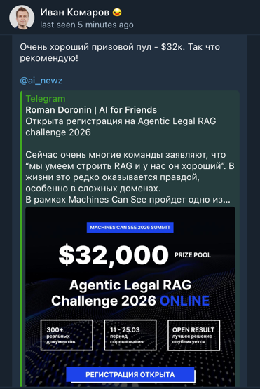
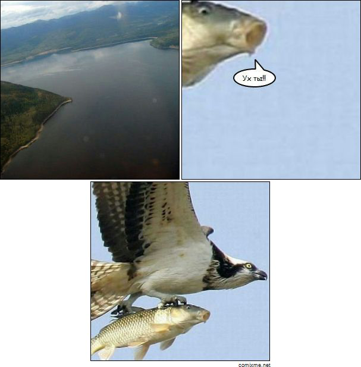
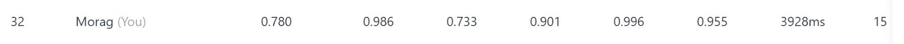

# Рагостроение на соревновательной скорости. Morag на ALRC 2026!

Такое сообщение пришло мне от шефа, ранним утром в субботу 14 марта.
Последние 12 месяцев мы с Ваней только и делали, что строили РАГи — чанки, эмбеддеры, реранкеры, конференции. Наше окружение уже привыкло к слову "рагостроение". Несколько месяцев назад мы уже обкатали систему на собственной Confluence-документации, где мы совершенствовали пайплайн за счет вручную выверенных вопросов (и достигли в этом определенных успехов). А тут — международное соревнование! **Надо регистрироваться!**

Может главного приза мы не выиграем, но зато устроим отличный бенчмарк. Команда — по имени проекта: **Morag**. Слоган: _Need more RAG? Use Morag!_

На следующий день регистрация принята, доступ к данным получен.

## Пайплайн индексации
### Готовим чанки!
Документы нужно нарезать на **чанки** — кусочки, по которым будет делаться поиск. Большинство популярных решений (LightRAG, GraphRAG, Open WebUI) не заморачиваются: _"режем по N символов с перекрытием, нейронки разберутся!"_

Нейронка, конечно, разберётся. Но будет выглядеть примерно так:

Если резать по символам — можно разрезать слово пополам и получить новый смысл. Это **я как дата анал**|итик могу утверждать точно.

Идеальный чанк — **законченная мысль** из документа. Можно поручить это большой LLM, но на соревновании это слишком долго и дорого.
Хорошо, что накануне, мы сделали [семантический чанкинг](../docs/adr/0001-markdown-parsing-and-chunking-strategy.md). Альтернатива, которая на тестах давала хорошие результаты с неплохим временем работы.

### Сила контекста
Если мы разделим документ на чанки, то тут же потеряем их связь.

Любая из этих картинок совершенно непонятна без двух остальных.
И чтобы подготовить контекст, берем текст чанка, весь документ и просим LLM описать контекст вокруг этого чанка и его роль на странице.

### Как выглядит идеальный чанк
Каждый содержит:
* text: который передает законченную мысль или факт или утверждение из документа
* path: название документа откуда он взят
* context: дает полное представление об окружении чанка

Каждый чанк должен быть компактным и не превышать 512 токенов, чтобы наш эмбедер [FRIDA](https://huggingface.co/ai-forever/FRIDA) смог корректно его векторизовать.
К слову, возможно это не самый лучший эмбеддер для этой соревы. Зато он поддерживает префиксы, учился на русском и английском. Да и в конце концов будет очень интересно как он себя покажет.
Для поиска по ключевым словам, помогать ему будет [sparse-модель GTE](https://huggingface.co/Alibaba-NLP/gte-multilingual-base).
В качестве базы будет Qdrant.

## Пайплайн ответов
Он максимально прост. И как сказал Claude, даже элегантен.

Для каждого вопроса делается:
* **Стадия Intent**: согласно промпту LLM модель формулирует несколько вариантов вопросов для поиска
* **Стадия Select**: каждый вопрос превращаем в вектора FRIDA и GTE ищем в Qdrant, делаем RRF, берем top N чанков из базы. Нумеруем полученные чанки, и в промпте и отдаем большой LLM, чтобы она выступила своеобразным реранкером, сказала какие чанки пригодятся для ответа.
* **Стадия Answer**: отфильтрованные чанки на Select снова отдаем LLM, но на этот раз с требованием ответить на вопрос плюс назвать номера чанков которые были использованы в ответе (надо для указания номеров страниц).

Таким образом, мы формулируем нашу задачу: нужно сделать все, чтобы LLM пользуясь самыми лучшими чанками в мире смогла выдавать максимально адекватные и точные ответы.

А соревнование выступит отличным бенчмарком!

## Warmup: битва за каждую десятую.

30 файлов. Юридические. Все на английском. Никого из нас в юриспруденции не было ни дня.

Зато перед нами 100 вопросов, 15 попыток на отправку. 30 pdf файлов. 
Каждый ответ оценивается по формуле:

**Total = (0.7 × Det + 0.3 × Asst) × G × T × F**

Если по-человечески:
- **Det** — точность на вопросах с однозначным ответом (числа, даты, да/нет, имена). Либо попал, либо нет.
- **Asst** — качество развёрнутых текстовых ответов. Оценивает LLM-судья по пяти критериям.
- **G (Grounding)** — попал ли ты в правильные страницы документа. **Множитель!**
- **T** — корректность телеметрии (формат, тайминги). Почти у всех ~1.0.
- **F** — средняя скорость ответа (TTFT). Быстрее 1 секунды — бонус, медленнее 3 — штраф.

Grounding — главный враг. Даже идеальный ответ обнуляется, если указал не ту страницу.

## Парсим PDF и индексируем
30 PDF нужно превратить в Markdown. Вместо тяжёлого Docling взяли [визуальный подход](../docs/adr/0002-vision-llm-model-selection.md): каждая страница PDF рендерится в картинку и уходит в qwen3.5-9b — 30 файлов за 12 минут на MacStudio с M3Ultra.

Дальше — индексация. Запускаем пайплайн и ждём. Семантический чанкер нарезал 30 документов на 1976 чанков. Для каждого чанка нужно сгенерировать контекст через LLM (qwen3.5-9b), посчитать dense-эмбеддинг (FRIDA) и sparse-эмбеддинг (GTE). Оба эмбеддера крутились нативно, прямо на том же маке.

Одним из открытий этой индексации, стало то, что MacStudio с всей своей мощью абсолютно не пригоден для формирования контекста чанков. Все портит очень длинная стадия prefill, если ваш промпт объемен. В итоге на один чанк уходило по 15-20 секунд ожиданий и мы раскошелились на OpenRouter с тем же Квеном. 

Эмбеддинги считались быстро, Qdrant заливал мгновенно. В итоге индексация 30 документов: ~2 часа. Из них большая часть — генерация контекстов через LLM. 

### Начинаем бороться

Первый прогон на qwen3.5-9b — треть ответов мимо, Grounding стыдный, место в хвосте рейтинга. Маленький Qwen хорош для обобщения, но не тянет точные ответы. Особенно на multi-document вопросах типа "есть ли общие стороны в делах А и B?" — модель просто не находила оба документа и отвечала null.

Единственное утешение: наши метрики всё равно оказались лучше, чем у встроенных рагов Грока и OpenAI!
Это казалось очень странным, но стоит отметить что, туда были отправлены оригинальные PDF, а не markdown. 

### Прощай Qwen3.5 — переломный момент

Попробовали GPT-4.1 — упёрлись в rate limit OpenAI. Перешли на Grok — заработало сразу. Дальше пошло веселее: убрали null-ы на сложных вопросах, подключили reasoning модель для точных ответов — и **все детерминистичные ответы стали правильными**!

### И всё-таки он агентский
Посмотрели на название соревнования: **Agentic** Legal RAG. Задались вопросом: "А где agentic у нас?".

В 2 ночи на 4-й день соревнования делаем на изоленте: после выбора чанков модель сама решает — хватает ли данных для ответа? 
Если нет — формулирует уточняющий запрос и делает ещё один раунд поиска. 
К слову, сработало отлично! За 100 вопросов более 10 уточнений — и каждый раз помогало.

### Агентское читерство
А что если Клод сам сделает golden ответы? `Клод, сформируй ответы на вопросы из md файлов`. Клод - красавчик, он тут же породил 4 агента, которые за 25 минут прошерстили все файлы — и golden.json оказался пугающе близок к правде. После этого мы кратно увеличили число проверок.

### Вайбкодинг и последствия!
После успеха с голден: Нам нужно время! нам нужна скорость! `Клод, есть новое задание! Надо сформировать json с телеметрией для ответа. Требования прочти в starter_kit` 
Что-то появилось, какие-то файлы изменились! нет времени разбираться! надо коммитить!

А тем временем оказывается, соревнование требует max 280 символов для free_text.
Как это сделано в вайбкоде? Правильно: `answer[:280]`. Nuff said.

Переделали: длинный ответ теперь сжимается отдельным LLM-вызовом, пока не влезет в лимит.

### Последний рывок: Grounding

Мы работали командой. Иван — RnD, я — код Morag, Клод послушно строчит код и проводит анализ запусков.

К 11-й попытке все детерминистичные ответы были идеальными, но — 49-е место. Grounding съедал четверть результата. Нужно было прицельно бить в эту метрику.

Ваня обнаружил: если добавлять страницы 1-3 документов, упомянутых в вопросе — Grounding резко растёт. На первых страницах почти всегда заголовок, стороны дела, судья, дата — именно то, что спрашивают.

Перестроили doc_summary в структурированный формат, перегенерировали sparse vectors с учётом summary, добавили обобщения с учетом юридической тематики. Grounding скакнул, Total вырос. Место — **32 из 350**.

15-я попытка из 15. Все попытки разогрева исчерпаны, но каждая была не зря.

### Цифры пути

| Версия | Det | Asst | G | Total | Что изменилось |
|--------|-----|------|-------|-------|---------------|
| v4 (qwen baseline) | 0.671 | 0.693 | 0.552 | **0.374** | Стартовая точка |
| v9 (grok first) | 0.829 | 0.713 | 0.627 | **0.480** | +28% от перехода на Grok |
| v10 (150 multidoc) | 0.986 | 0.693 | 0.718 | **0.626** | Ноль null-ов |
| v11 (det идеальный) | **1.000** | 0.680 | 0.757 | **0.664** | Det идеальный, место 49 |
| **v15 (финал warmup)** | **0.986** | **0.733** | **0.901** | **0.780** | **Grounding +0.144, место 32** |

## Публичный этап: 300 документов за два дня

### 21 марта. Утро надежд

Организаторы открыли публичный этап. Вместо 30 документов — **300**. Вместо 100 вопросов — **900**. Прогулочный warmup закончился, начинается настоящее соревнование.

В прочем, PDF распарсился достаточно быстро, примерно 3 часа.
Запускаем индексацию. **Concurrency в 32 документа одновременно**. Поехали!

### Матрёшка из проблем

Индексация 300 документов превратилась в инженерный квест. Каждая решённая проблема открывала следующую — как матрёшка:

**OpenRouter задыхается.** 32 потока бомбят API. При ошибке, поток засыпает на 5 минут, затем просыпается, и все бомбят снова. Thundering herd в чистом виде. [Добавили rate limiter с jitter](../docs/adr/0004-llm-rate-limiting.md) — OpenRouter всё равно лёг на несколько часов. Плюнули, переключились на Grok.

**Эмбеддеры на GPU блокирует всё.** PyTorch через GIL не даёт параллелить. Docker — 42 секунды на текст (ну нет Metal GPU в docker на маке). Перешли на нативный HTTP-сервер: отдельный процесс, MPS, батч за 0.76с. [Заработало!](../docs/adr/0005-async-embedder-calls.md)

**Документ-монстр на 537 страниц.** SemanticChunker который казался таким быстрым, молотил только этот документ более часа. Как итог режем просто по заголовкам: 740 чанков за 2 секунды, плюс [значительно оптимизировали](../docs/adr/0006-passthrough-fallback-and-context-window.md) создание контекста. Кстати когда он все-таки был обработан, мы тут же упали на векторизации из-за огромного числа чанков. Разумеется [поправили](../docs/adr/0007-embed-batch-size.md).

**Кредиты кончились в 4 утра.** Поставили индексацию, ушли спать. Утром: 115 failed. Причина: у Илона Маска кончились деньги... Закинули, досчитали.

По итогу: 300 документов за 25 запусков. **Индексация ~12 часов. 5 ADR. 13 923 чанка.**

### 900 вопросов и вскрытие

Пайплайн стабилен. Запускаем 900 вопросов...
После 5 часов прогона — **Total 0.603**. Больно. Значительно хуже warmup.

Разбираем ошибки с помощью Ваниного golden (Gemini + Claude + Grok + день работы). 
Самая яркая из ошибок: 26 вопросов "Было ли дело обжаловано?" — мы отвечали Да, потому что видели "Заявление на апелляцию подано". Абсолютно упуская из виюду короткое "В разрешении на апелляцию отказано".
Но зато это самая быстрая правка. Всего одна строка в промпте, даже не в коде — и 26 ошибок исчезли!

### Morag vs Golden

Долго мучались муками совести, честно будет это или нет.
Но сошлись на том, что golden это лучшее что у нас есть и ответы получены при помощи открытых LLM, что номинально соответствует правилам _(нет)_.  
По итогу второй и последней попыткой, засабмитили golden ответы (те самые, на которые мы ориентировались при тюнинге). И тут — сюрприз.

| Метрика | Morag | Golden |
|---------|-------|--------|
| S_det | **0.877** | 0.872 |
| S_asst | **0.760** | 0.713 |
| G | 0.728 | **0.788** |
| F | **0.985** | 0.971 |
| **Total** | 0.603 | **0.631** |

Оказывается Morag **превзошёл golden** по трём из пяти метрик. Наши детерминистичные ответы точнее. Наши свободные ответы качественнее. Мы быстрее.

Golden выиграл только по Grounding — потому что создавался с точным знанием страниц. Но это не вопрос качества ответов, а техническая задача привязки к страницам.

К нашему удивлению, наша RAG-система превзошла рукотворный golden! Не по всем метрикам, но по самым важным. Вы не представляете насколько это было приятнее осознавать, даже понимая, что с такими метриками Grounding, мы вряд ли прорвемся в топ 3.

**Но зато Morag работает!**
